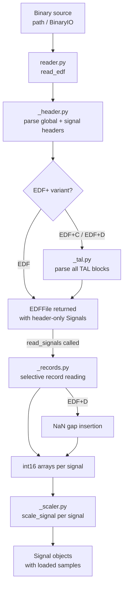

# Design Document: EDF File Reader

## Overview

The `edf-file-reader` feature adds a complete EDF/EDF+ binary file reader to the
`edfplus` Python library. It parses the global and per-signal headers, reads data
records, scales digital samples to physical values (linear and edffloat logarithmic),
extracts EDF+ TAL annotations, and handles discontinuous (EDF+D) recordings with
gap-filling. The public entry point is a single `read_edf()` function that returns an
`EDFFile` object with lazy signal loading.

The design targets Python ≥ 3.14, NumPy ≥ 2.5.1, and uses the `uv` build system with
the `src` layout. All public types are fully typed (PEP 561, `ty` type checker) and
documented with Google-style docstrings.

### Key Design Goals

- **Correctness**: Faithfully implement the EDF/EDF+/edffloat specs as documented in `edf.md`.
- **Memory efficiency**: Lazy, selective signal loading — only requested channels are read from disk.
- **Simple public API**: A single `read_edf()` function covers all use cases.
- **Round-trip fidelity**: Header bytes survive a parse-then-format cycle unchanged.
- **Type safety**: All internal and public APIs are fully statically typed.


---

## Architecture

The reader is structured as a pipeline of focused internal modules under
`src/edfplus/`. Each module has a single responsibility; the top-level `reader.py`
orchestrates them.

```
read_edf()
  │
  ├── _header.py   parse_global_header()      → EDFHeader
  │                parse_signal_headers()     → list[SignalHeader]
  │
  ├── _tal.py      parse_tals()               → (float | None, list[Annotation])
  │                  (called per data-record for EDF+ files)
  │
  ├── _records.py  read_signal_data()         → dict[int, ndarray[int16]]
  │                  (seeks selectively; inserts NaN gaps for EDF+D)
  │
  ├── _scaler.py   scale_signal()             → ndarray[float64 | floatN]
  │                  (linear or edffloat branch per signal)
  │
  └── _models.py   EDFHeader, SignalHeader, Signal, Annotation, EDFFile
                     (all public data types; Signal.timestamps/datetimes
                      computed lazily from loaded sample arrays)
```

### Data Flow




---

## Components and Interfaces

### `reader.py` — Public entry point

```python
def read_edf(
    source: str | pathlib.Path | BinaryIO,
    *,
    physical: bool = True,
    dtype: numpy.dtype | type | None = None,
    tzinfo: datetime.tzinfo | None = None,
) -> EDFFile: ...
```

Responsibilities:
- Validate `source` type; open file if path given.
- Validate `tzinfo` type (raise `TypeError` if not `datetime.tzinfo`).
- Validate `dtype`/`physical` combination (raise `ValueError` if `dtype` set and `physical=False`).
- Delegate to `_header.py`, then construct header-only `Signal` stubs.
- For EDF+ variants, parse all TALs up-front and attach `annotations` to the `EDFFile`.
- Return an `EDFFile` with `physical`, `dtype`, and the open file handle stored so that
  `read_signals()` can later seek back into the file.

The file handle is kept open inside `EDFFile` until the user explicitly closes it (or
uses the context-manager protocol). This avoids re-opening the file on every
`read_signals()` call while still supporting lazy loading.

---

### `_header.py` — Header parsing

```python
def parse_global_header(
    data: bytes,
    file_size: int,
    tzinfo: datetime.tzinfo | None,
) -> EDFHeader: ...

def parse_signal_headers(
    data: bytes,
    ns: int,
    record_duration: float,
) -> list[SignalHeader]: ...
```

`parse_global_header` reads the fixed 256-byte block, parses all fields in one pass,
applies the two-digit year rule (`yy >= 85 → 19xx`, else `20xx`), attaches `tzinfo` to
the resulting `time` and `datetime` objects, and returns an `EDFHeader`.

`parse_signal_headers` reads the `ns × 256`-byte per-signal block. The EDF format
stores all values for each field contiguously (e.g. all labels first, then all
transducer types, etc.) rather than one signal at a time. The parser must therefore
stride through the buffer by field width × signal count.

Both functions raise `ValueError` on any malformed field before returning any result.

For EDF+ patient/recording subfield parsing:
- Split on ASCII space, take positional subfields.
- `"X"` maps to `None`.
- Underscores within a non-`None` value are replaced with spaces.
- Birthdate / startdate subfields are parsed via `datetime.strptime(val, "%d-%b-%Y")`.


---

### `_records.py` — Data record reading

```python
def read_signal_data(
    f: BinaryIO,
    header: EDFHeader,
    signal_headers: list[SignalHeader],
    indices: list[int],
) -> dict[int, numpy.ndarray]: ...
```

Reads the data records portion of the file (offset = `header.header_bytes`) and returns
raw `int16` arrays for each requested signal index.

**Selective loading**: For each record the function iterates over all signals in file
order. For a requested signal it calls `f.read(n_bytes)`; for a non-requested signal it
calls `f.seek(n_bytes, 1)` (relative seek) to skip without allocating memory. This means
reading a single channel from a 256-channel file reads ≈ 1/256 of the data bytes.

**EDF+D gap insertion**: After reading all records, the function reads the time-keeping
TAL for each record (via `_tal.py`). When the time-keeping onset of record `r+1` exceeds
`onset_r + record_duration`, it inserts `floor(gap_samples)` `NaN` values into the
int16 accumulator as `float32` NaN-encoded values. Because `int16` cannot represent NaN,
the accumulator for EDF+D signals is promoted to `float32` before gap insertion; the
`_scaler.py` module is aware of this and handles the NaN-passthrough.

**Record count inference**: When `header.num_records == -1`, the count is computed as
`(file_size - header_bytes) // bytes_per_record` before the reading loop begins.


---

### `_scaler.py` — Scaling

```python
def scale_signal(
    digital: numpy.ndarray,
    sh: SignalHeader,
    dtype: numpy.dtype | None,
) -> numpy.ndarray: ...
```

Two scaling paths:

**Linear** (default):
```
gain = (physical_max - physical_min) / (digital_max - digital_min)
physical = physical_min + (digital - digital_min) * gain
```
Guard: if `digital_max == digital_min`, return an array filled with `physical_min`.

**edffloat** (triggered when `physical_dimension == "Filtered"` and
`physical_max == digital_max == 32767`):
- Parse `Ymin` and `a` from the prefiltering field via regex:
  `r"sign\*LN\[sign\*\((.{8})\)/\((.{8})\)\]/\((.{8})\)"` — captures dim, Ymin, a.
- Three-branch transform applied element-wise:
  - `N > 0` → `Ymin * exp(a * N)`
  - `N == 0` → `0.0`
  - `N < 0` → `-Ymin * exp(-a * N)`
- Raise `ValueError` if Ymin ≤ 0 or a ≤ 0 or regex fails to match.

NaN passthrough: NaN values in the input (from EDF+D gap insertion) must be preserved
in the output. The scaler masks NaN positions before applying the formula and restores
them afterwards.

The `dtype` parameter, if provided, casts the final float output via `.astype(dtype, copy=False)`.


---

### `_tal.py` — TAL / Annotation parsing

```python
def parse_tals(
    data: bytes,
    record_index: int,
) -> tuple[float | None, list[Annotation]]: ...
```

Returns `(timekeeping_onset, annotations)` where `timekeeping_onset` is the onset
of the first TAL in the record (which has empty text and is used for EDF+D timing) and
`annotations` is the list of non-timekeeping `Annotation` objects.

**Parsing algorithm**:
1. Scan byte-by-byte for TAL boundaries (`0x00` terminates the block; unused trailing bytes are `0x00`).
2. Within a TAL, split on `0x15` to separate the onset+duration token from the text tokens.
3. Split on `0x14` to separate individual text strings; discard empty strings.
4. Parse onset and optional duration from ASCII decimal text.
5. Validate onset in `[-999999.999, +999999.999]`; raise `ValueError` if out of range,
   including `record_index` in the message.
6. The first TAL in a record always has empty text; its onset becomes `timekeeping_onset`
   and it is excluded from the returned annotation list.


---

### `_models.py` — Data models

All public types live here. `EDFFile` and `Signal` contain the bulk of the user-facing
API.

See the Data Models section below for field-by-field descriptions.

---

### `__init__.py` — Public API surface

```python
from edfplus.reader import read_edf
from edfplus._models import EDFFile, EDFHeader, SignalHeader, Signal, Annotation

__all__ = ["read_edf", "EDFFile", "EDFHeader", "SignalHeader", "Signal", "Annotation"]
```

---

## Data Models

### `EDFHeader`

```python
@dataclass(frozen=True)
class EDFHeader:
    # Raw decoded fields
    version: str                          # always "0"
    local_patient_id: str                 # raw 80-byte field, stripped
    local_recording_id: str               # raw 80-byte field, stripped
    num_records: int                      # actual count (inferred if -1 in file)
    record_duration: float                # seconds per data record
    num_signals: int                      # ns (includes annotation signal if present)
    header_bytes: int                     # 256 + ns*256

    # Variant
    variant: Literal["EDF", "EDF+C", "EDF+D"]

    # Parsed date/time
    start_date: datetime.date
    start_time: datetime.time             # timezone-naive unless tzinfo provided
    start_datetime: datetime.datetime     # combines start_date + start_time

    # EDF+ patient subfields (None for plain EDF)
    patient_code: str | None
    patient_sex: str | None
    patient_birthdate: datetime.date | None
    patient_name: str | None

    # EDF+ recording subfields (None for plain EDF)
    recording_startdate: datetime.date | None
    recording_admin_code: str | None
    recording_technician: str | None
    recording_equipment: str | None

    # Raw bytes for round-trip fidelity
    _raw_global: bytes                    # original 256 bytes (private)
    _raw_signals: bytes                   # original ns*256 bytes (private)
```


### `SignalHeader`

```python
@dataclass(frozen=True)
class SignalHeader:
    label: str                  # stripped
    transducer_type: str        # stripped
    physical_dimension: str     # stripped
    physical_min: float
    physical_max: float
    digital_min: int
    digital_max: int
    prefiltering: str           # stripped
    samples_per_record: int
    sample_rate: float          # derived: samples_per_record / record_duration
    is_annotation: bool         # True for "EDF Annotations" channels
```

### `Annotation`

```python
@dataclass(frozen=True)
class Annotation:
    onset: float                # seconds from recording start
    duration: float | None      # seconds; None if absent in TAL
    texts: list[str]            # one or more annotation text strings (never empty strings)
```

### `Signal`

`Signal` holds a reference to its `SignalHeader` and, after `read_signals()` is called,
a loaded sample array. Before loading, `_samples` is `None`.

```python
class Signal:
    # --- Construction (internal) ---
    def __init__(
        self,
        header: SignalHeader,
        edf_header: EDFHeader,
        samples: numpy.ndarray | None = None,
    ) -> None: ...

    # --- Header pass-through properties (read-only) ---
    @property
    def label(self) -> str: ...
    @property
    def transducer_type(self) -> str: ...
    @property
    def physical_dimension(self) -> str: ...
    @property
    def physical_min(self) -> float: ...
    @property
    def physical_max(self) -> float: ...
    @property
    def digital_min(self) -> int: ...
    @property
    def digital_max(self) -> int: ...
    @property
    def prefiltering(self) -> str: ...
    @property
    def samples_per_record(self) -> int: ...
    @property
    def sample_rate(self) -> float: ...

    # --- Sample access ---
    @property
    def samples(self) -> numpy.ndarray: ...        # float64 physical; raises if not loaded
    def physical_samples(self, dtype: numpy.dtype | type | None = None) -> numpy.ndarray: ...
    def digital_samples(self) -> numpy.ndarray: ...  # int16

    # --- Time arrays ---
    def timestamps(self) -> numpy.ndarray: ...     # float64, seconds from start; NaN at gaps
    def datetimes(self) -> numpy.ndarray: ...      # datetime64; NaT at gaps
```

`timestamps()` implementation:
```python
n = len(self._samples)
ts = numpy.arange(n, dtype=numpy.float64) / self.sample_rate
nan_mask = numpy.isnan(self._samples)
if nan_mask.any():
    ts[nan_mask] = numpy.nan
return ts
```

`datetimes()` implementation:
```python
ts = self.timestamps()
origin = numpy.datetime64(self._edf_header.start_datetime, 'us')
delta = (ts * 1_000_000).astype('timedelta64[us]')
result = origin + delta
result[numpy.isnan(ts)] = numpy.datetime64('NaT')
return result
```


### `EDFFile`

```python
class EDFFile:
    def __init__(
        self,
        header: EDFHeader,
        signals: list[Signal],            # header-only stubs
        annotations: list[Annotation],
        _f: BinaryIO,                     # kept open for lazy loading
        _physical: bool,
        _dtype: numpy.dtype | None,
    ) -> None: ...

    @property
    def header(self) -> EDFHeader: ...
    @property
    def signals(self) -> list[Signal]: ...   # header-only until read_signals() called
    @property
    def annotations(self) -> list[Annotation]: ...

    def read_signals(
        self,
        signals: Sequence[str] | Sequence[int] = (),
    ) -> list[Signal]: ...

    # Context manager protocol for resource cleanup
    def __enter__(self) -> EDFFile: ...
    def __exit__(self, *args: object) -> None: ...
    def close(self) -> None: ...
```

`read_signals()` logic:
1. Resolve `signals` to a sorted list of unique integer indices (validating each
   label/index along the way and preserving the caller's requested order in the result).
2. Call `_records.read_signal_data(f, header, signal_headers, sorted_indices)`.
3. For each requested index, call `_scaler.scale_signal(raw, sh, dtype)` if
   `physical=True`, else keep raw `int16`.
4. Construct new `Signal` objects with loaded samples and return them in the order the
   caller requested (not file order).

Signal access on `EDFFile` (by label or index) returns the header-only stub. The loaded
`Signal` objects are returned from `read_signals()` and are not automatically stored
back into `EDFFile.signals`; callers hold the loaded signals themselves. This avoids
double-loading and keeps the API explicit.


---

## Module Layout

```
src/edfplus/
├── __init__.py        # re-exports: read_edf, EDFFile, EDFHeader,
│                      #             SignalHeader, Signal, Annotation
├── py.typed           # PEP 561 marker
├── reader.py          # read_edf() — orchestrates all sub-modules
├── _header.py         # parse_global_header(), parse_signal_headers()
├── _records.py        # read_signal_data()
├── _scaler.py         # scale_signal()
├── _tal.py            # parse_tals()
└── _models.py         # EDFHeader, SignalHeader, Signal, Annotation, EDFFile

tests/
├── ST7011J0-PSG.edf   # real PSG file for integration tests
├── test_header.py     # unit + property tests for _header.py
├── test_records.py    # unit + property tests for _records.py
├── test_scaler.py     # unit + property tests for _scaler.py
├── test_tal.py        # unit + property tests for _tal.py
├── test_models.py     # unit tests for Signal / EDFFile API
├── test_reader.py     # end-to-end / integration tests for read_edf()
└── conftest.py        # shared fixtures (e.g. helpers to build synthetic EDF bytes)
```

The leading underscore on `_header`, `_records`, `_scaler`, `_tal`, and `_models`
marks them as internal modules. Users import only from `edfplus` (the `__init__.py`).


---

## Correctness Properties

*A property is a characteristic or behavior that should hold true across all valid
executions of a system — essentially, a formal statement about what the system should
do. Properties serve as the bridge between human-readable specifications and
machine-verifiable correctness guarantees.*

### Property 1: Global header round-trip

*For any* valid 256-byte global header byte sequence, parsing it then formatting the
parsed `EDFHeader` back to bytes SHALL produce a byte-for-byte identical result.

**Validates: Requirements 9.1, 9.3**

---

### Property 2: Per-signal header round-trip

*For any* valid `ns × 256`-byte per-signal header byte block (for any `ns ≥ 1`),
parsing then formatting SHALL produce byte-for-byte identical output.

**Validates: Requirements 9.2, 9.3**

---

### Property 3: Linear scaling invertibility

*For any* valid combination of `physical_min`, `physical_max`, `digital_min`,
`digital_max` (where `digital_min ≠ digital_max`) and any array of `int16` digital
values, applying the linear scaling formula and then its algebraic inverse SHALL recover
the original digital values to within ±1 LSB (rounding artefact).

**Validates: Requirements 4.2, 4.3**

---

### Property 4: edffloat scaling invertibility

*For any* valid `Ymin > 0`, `a > 0`, and integer `N`, applying the edffloat digital→physical
transform and then the physical→digital inverse SHALL recover `N` exactly (integer
round-trip).

**Validates: Requirements 5.3, 5.4, 5.5**

---

### Property 5: Invalid version bytes rejected

*For any* byte string of length 8 that is not `b"0       "`, constructing an EDF file
header with that version field and calling `read_edf()` SHALL raise a `ValueError`.

**Validates: Requirements 1.3**

---

### Property 6: Invalid reserved field rejected

*For any* non-blank reserved field string that does not start with `"EDF+C"` or
`"EDF+D"`, `parse_global_header()` SHALL raise a `ValueError`.

**Validates: Requirements 2.5**

---

### Property 7: Two-digit year century rule

*For any* two-digit year value `yy` in `[0, 99]`, the parsed `start_date.year` SHALL
be `1900 + yy` when `yy ≥ 85` and `2000 + yy` when `yy < 85`.

**Validates: Requirements 2.7**

---

### Property 8: String fields are stripped of surrounding whitespace

*For any* signal header string field (label, transducer_type, physical_dimension,
prefiltering) that contains arbitrary leading and/or trailing ASCII spaces, the parsed
`SignalHeader` field SHALL contain no leading or trailing spaces.

**Validates: Requirements 3.4**

---

### Property 9: Sample rate derivation

*For any* `samples_per_record ≥ 1` and `record_duration > 0`, the computed
`SignalHeader.sample_rate` SHALL equal `samples_per_record / record_duration` exactly
(as a Python `float`).

**Validates: Requirements 3.2**

---

### Property 10: timestamps() and samples are co-length and correctly indexed

*For any* loaded `Signal` with `n` samples and `sample_rate > 0`, `timestamps()` SHALL
return an array of length `n` where `timestamps()[i] == i / sample_rate` for all
non-NaN positions `i`.

**Validates: Requirements 4.10**

---

### Property 11: datetimes() and samples are co-length

*For any* loaded `Signal`, `datetimes()` SHALL return an array of exactly the same
length as `samples`, and each non-NaT element SHALL equal
`start_datetime + timedelta(seconds=timestamps()[i])`.

**Validates: Requirements 4.11**

---

### Property 12: NaN positions in samples and timestamps() are co-located

*For any* EDF+D `Signal` that contains gap-inserted NaN values,
`numpy.isnan(signal.samples)` SHALL equal `numpy.isnan(signal.timestamps())`
element-wise (same positions, same count).

**Validates: Requirements 8.2, 4.10**

---

### Property 13: EDF+D gap NaN count matches formula

*For any* pair of consecutive EDF+D data records with a gap of `gap_duration` seconds
and a signal with `sample_rate` Hz, the number of NaN values inserted SHALL equal
`floor(gap_duration * sample_rate)`.

**Validates: Requirements 8.2**

---

### Property 14: read_signals subset returns same samples as full load

*For any* EDF file and any non-empty subset `S` of signal indices,
`read_signals(S)[k].samples` SHALL be element-wise equal to
`read_signals()[i_k].samples` where `i_k` is the position of `S[k]` in the full signal
list.

**Validates: Requirements 10.18, 10.23**

---

### Property 15: read_signals preserves caller-requested order

*For any* permutation of signal labels (or indices), the list returned by
`read_signals(labels)` SHALL be in the same order as `labels`.

**Validates: Requirements 10.19, 10.20**

---

### Property 16: "X" subfield maps to None for all positions

*For any* of the four positional subfields in the EDF+ patient identification field,
supplying `"X"` as the subfield value SHALL cause the corresponding `EDFHeader`
attribute to be `None`.

**Validates: Requirements 6.2**

---

### Property 17: Underscore-to-space replacement in subfield values

*For any* EDF+ subfield string (not `"X"`) that contains one or more underscores, the
value returned by `EDFHeader` SHALL have every underscore replaced by a space, with no
other characters changed.

**Validates: Requirements 6.8**

---

### Property 18: TAL onset ordering in annotations list

*For any* EDF+ file containing multiple annotations with arbitrary onset values, the
`EDFFile.annotations` list SHALL be in strictly non-decreasing onset order.

**Validates: Requirements 7.4**

---

### Property 19: TAL parse recovers onset and duration

*For any* valid TAL byte sequence with a numeric onset in `[-999999.999, +999999.999]`
and an optional numeric duration, `parse_tals()` SHALL return an `Annotation` whose
`onset` and `duration` fields match the values encoded in the byte sequence (within
floating-point precision).

**Validates: Requirements 7.2**

---

### Property 20: Empty annotation texts are excluded

*For any* TAL byte sequence containing one or more empty text segments (`0x14 0x14`
adjacent), the resulting `Annotation.texts` list SHALL not contain any empty strings.

**Validates: Requirements 7.3**

---

### Property 21: Invalid numeric header fields raise ValueError for any field

*For any* non-numeric byte string injected into a numeric global header field
(`ns`, `num_records`, `record_duration`), `parse_global_header()` SHALL raise a
`ValueError` that identifies the offending field name.

**Validates: Requirements 1.7, 2.8**


---

## Error Handling

All errors are raised as standard Python exceptions with descriptive messages. No
partial state is returned; every function either succeeds completely or raises.

| Condition | Exception | Key message details |
|---|---|---|
| Path does not exist | `FileNotFoundError` | path string |
| No read permission on path | `PermissionError` | path string |
| `source` not str/Path/BinaryIO | `TypeError` | argument name, received type |
| `source` BinaryIO missing `.read()`/`.seek()` | `TypeError` | which method is missing |
| `tzinfo` not a `datetime.tzinfo` instance | `TypeError` | argument name, received type |
| `dtype` provided with `physical=False` | `ValueError` | clear description |
| Version field ≠ `"0       "` | `ValueError` | found version, "unsupported" |
| Header byte count ≠ `256 + ns*256` | `ValueError` | "malformed header" |
| File shorter than declared header size | `ValueError` | "truncated header" |
| Non-blank unrecognized reserved field | `ValueError` | raw reserved value |
| Unparseable numeric global header field | `ValueError` | field name, raw value |
| Unparseable numeric per-signal field | `ValueError` | signal index (0-based), field name, raw value |
| `digital_max == digital_min` | no exception — returns `physical_min` fill | — |
| edffloat prefiltering parse failure | `ValueError` | signal label |
| edffloat `Ymin ≤ 0` or `a ≤ 0` | `ValueError` | signal label |
| TAL onset out of range / unparseable | `ValueError` | record index, raw onset bytes |
| Annotation signal data too short | `ValueError` | record index, byte shortfall |
| EDF+D record missing time-keeping TAL | `ValueError` | record index |
| EDF+D overlapping records | `ValueError` | record index, overlap duration |
| `read_signals` unknown label | `KeyError` | unrecognized label string |
| `read_signals` out-of-range index | `IndexError` | out-of-range index value |
| `EDFFile` label access unknown | `KeyError` | label string |
| `EDFFile` integer access out of range | `IndexError` | index value |


---

## Testing Strategy

### Dual Testing Approach

Two complementary test types are used:

- **Unit / example-based tests**: verify specific, concrete behaviors (happy paths,
  error conditions, API shape). Fast and deterministic.
- **Property-based tests** (via [Hypothesis](https://hypothesis.readthedocs.io/)):
  verify universal invariants across randomly generated inputs. Each property test is
  mapped 1:1 to a Correctness Property above.

### Property-Based Testing Library

**Hypothesis** is the standard property-based testing library for Python and is the
chosen tool here. Each property test must run a minimum of **100 iterations** (the
Hypothesis default is `max_examples=100`; this should not be reduced).

Each property test MUST include a tag comment identifying its design property:

```python
# Feature: edf-file-reader, Property 1: Global header round-trip
@given(raw_global_header())
@settings(max_examples=100)
def test_global_header_round_trip(header_bytes: bytes) -> None:
    ...
```

Add `hypothesis` to `[dependency-groups.dev]` in `pyproject.toml`.

### Unit Test Focus Areas

Unit tests cover:
- Happy-path examples with known input/output pairs (real PSG EDF file `ST7011J0-PSG.edf`).
- All documented error conditions (one test per exception type in the Error Handling table).
- EDF variant detection (`EDF`, `EDF+C`, `EDF+D`).
- Edge cases: `record_duration == 0`, `digital_max == digital_min`, `-1` record count,
  annotation-only files, empty annotation lists.
- API contract tests: `read_edf` imports, `EDFFile.header/signals/annotations` properties,
  `Signal` read-only property forwarding, context manager close behaviour.

### Property Test Mapping

| Property | Test module | Hypothesis strategy |
|---|---|---|
| 1 Global header round-trip | `test_header.py` | `raw_global_header()` composite strategy |
| 2 Per-signal header round-trip | `test_header.py` | `raw_signal_headers(ns)` composite strategy |
| 3 Linear scaling invertibility | `test_scaler.py` | `st.integers`, `st.floats` for calibration params |
| 4 edffloat invertibility | `test_scaler.py` | `st.floats(min_value=1e-6)` for Ymin/a, `st.integers` for N |
| 5 Invalid version rejected | `test_reader.py` | `st.binary(min_size=8, max_size=8).filter(...)` |
| 6 Invalid reserved field rejected | `test_header.py` | `st.text().filter(not blank and not starts with EDF+C/D)` |
| 7 Two-digit year century rule | `test_header.py` | `st.integers(min_value=0, max_value=99)` |
| 8 String fields stripped | `test_header.py` | `st.text(alphabet=st.characters(whitelist_categories=('L','N','P','S')))` with space padding |
| 9 Sample rate derivation | `test_header.py` | `st.integers(min_value=1)`, `st.floats(min_value=1e-6)` |
| 10 timestamps() co-length + indexing | `test_models.py` | `st.integers(min_value=1)` for n/sample_rate |
| 11 datetimes() co-length | `test_models.py` | same as Property 10 |
| 12 NaN co-location | `test_models.py` | synthetic EDF+D bytes with random gap positions |
| 13 EDF+D gap NaN count | `test_records.py` | `st.floats` for gap/sample_rate pairs |
| 14 read_signals subset correctness | `test_reader.py` | `st.lists(st.integers(...))` for index subsets |
| 15 read_signals order preservation | `test_reader.py` | `st.permutations(signal_labels)` |
| 16 "X" subfield → None | `test_header.py` | `st.sampled_from([0,1,2,3])` for subfield position |
| 17 Underscore → space | `test_header.py` | `st.text` with underscores injected |
| 18 TAL onset ordering | `test_tal.py` | `st.lists(st.floats(...))` for onset values |
| 19 TAL onset/duration round-trip | `test_tal.py` | `st.floats(-999999, 999999)` for onset |
| 20 Empty texts excluded | `test_tal.py` | `st.integers(min_value=0)` for empty text count |
| 21 Invalid numeric fields | `test_header.py` | `st.text().filter(not parseable as int/float)` |

### Test Fixtures (`conftest.py`)

Shared helpers that build synthetic valid EDF byte blobs programmatically, enabling
property strategies to construct legal inputs at any size. Key fixtures:

- `make_global_header(...)` → `bytes` (256 bytes, all fields configurable)
- `make_signal_headers(signals: list[dict])` → `bytes` (ns × 256 bytes)
- `make_data_record(samples: list[list[int]])` → `bytes`
- `make_tal_bytes(annotations: list[tuple])` → `bytes`

The real file `tests/ST7011J0-PSG.edf` is used for integration tests only.

